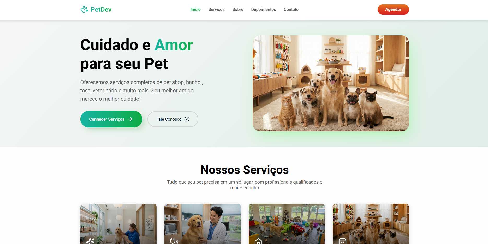

# 🐾 Petshop Dev

Landing Page responsiva para um pet shop fictício, desenvolvida com foco em boas práticas de desenvolvimento Front-end, animações suaves e experiência do usuário.

O projeto foi criado para praticar conceitos de React, componentização, gerenciamento de estado, navegação entre seções e criação de interfaces modernas e responsivas.

---

## 🚀 Tecnologias Utilizadas

- ⚛️ React
- 🎨 Sass (SCSS)
- 🎬 Motion
- ⚡ Vite

---

## 📌 Funcionalidades

✔️ Menu lateral responsivo para dispositivos móveis  
✔️ Destaque automático da seção ativa durante a navegação da página  
✔️ Navegação suave entre as seções  
✔️ Botões de contato com redirecionamento direto para o WhatsApp  
✔️ Animações leves para melhorar a experiência do usuário  
✔️ Layout totalmente responsivo para desktop, tablet e mobile  

---

## 📸 Preview

---

## 🌎 Deploy

Acesse o projeto online:

👉 https://clewertonrodrigues.github.io/petshop-dev

---

## 💡 Aprendizados

- Componentização de interfaces com React
- Organização e reutilização de componentes
- Gerenciamento de estado com Hooks
- Navegação entre seções da página
- Responsividade para diferentes dispositivos
- Criação de animações com Motion
- Estilização utilizando Sass (SCSS)
- Boas práticas de UX/UI